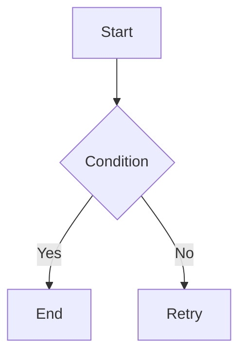

## ADDED Requirements

### Requirement: <!-- requirement name -->

<!-- requirement text -->

#### Scenario: <!-- scenario name -->

- **WHEN** <!-- condition -->
- **THEN** <!-- expected outcome -->

## MODIFIED Requirements

### Requirement: <!-- existing name -->

<!-- full updated content including scenarios -->

## Visual Requirements (Diagrams)

### Requirement: <!-- name --> Diagram

<!-- Optional description -->

